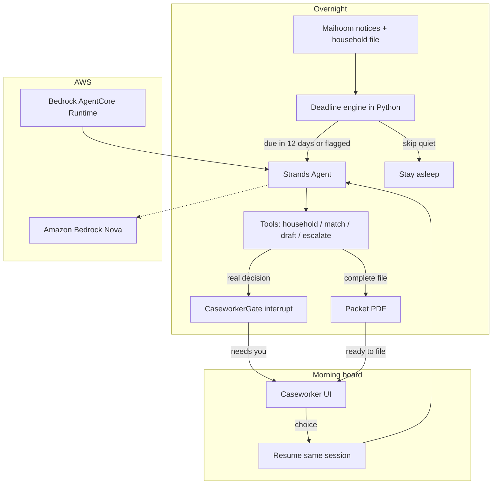

# StillOn architecture

Harbor Light runs one overnight Strands agent per household that is close to a drop date. Quiet enrollments never enter the model.

## What the model is allowed to do

| Work | Owner |
|---|---|
| Drop dates, urgency bands, paystub freshness | `deadlines.py` / `matching.py` |
| Which tool to call next | Strands agent loop |
| Wake a human | `escalate_decision` via `BeforeToolCallEvent.interrupt` |
| File a packet | `submit_packet`, also gated. Night prompt forbids it |

## Why this is not a chatbot

The morning board has no prompt box. The agent already ran. The only inputs are the two or three options on a paused interrupt.
